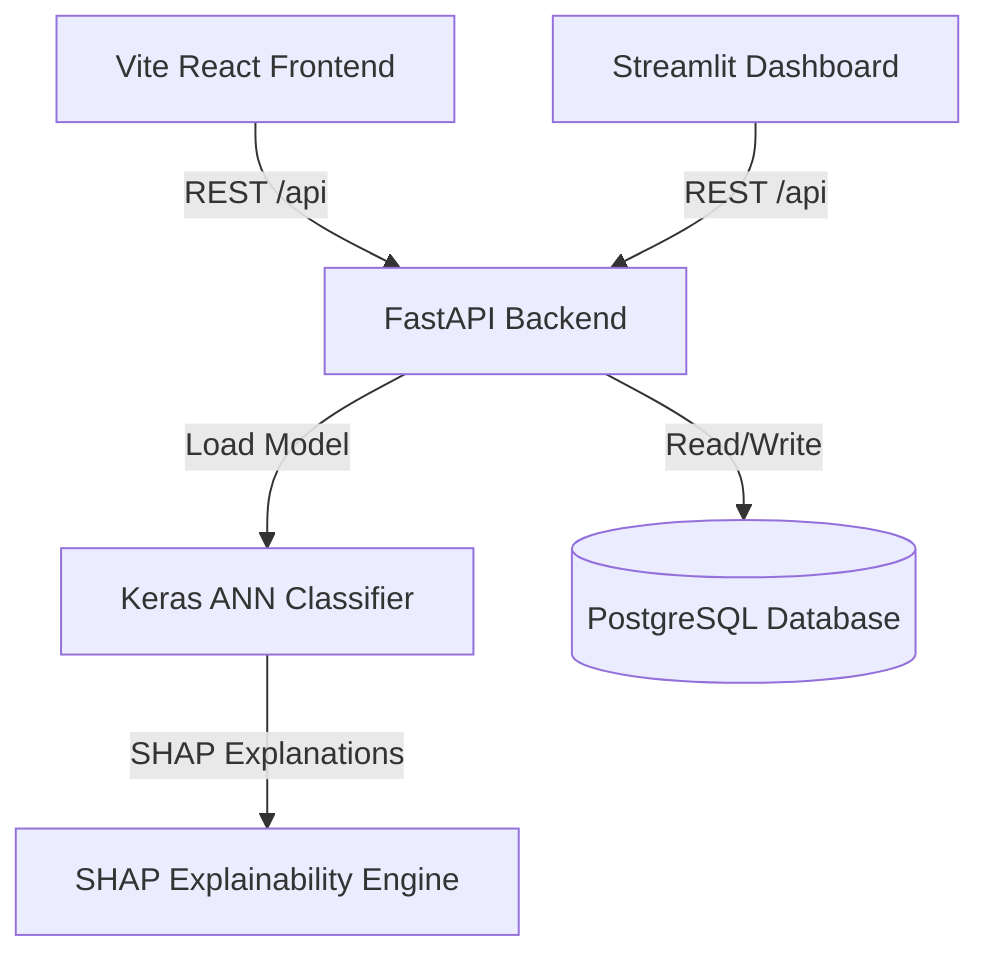

# FraudGuard — Deep Learning Credit Card Fraud Detection System

Production-quality Credit Card Fraud Detection system powered by Deep Artificial Neural Networks (ANN), featuring real-time PostgreSQL logging, a FastAPI backend, a React SPA, and a Streamlit monitoring dashboard.

---

## 🏗️ System Architecture



---

## 📈 ML Pipeline Execution (Where to Train)

The model training pipeline is decoupled from the web server runtime. Follow these steps to train your model and save weights for the API:

```bash
# 1. Download Credit Card Dataset from Kaggle:
# https://www.kaggle.com/datasets/mlg-ulb/creditcardfraud
# Place 'creditcard.csv' into data/ directory

# 2. Run Preprocessing Pipeline check
python notebooks/02_preprocessing.py

# 3. Train all ANN variants (SMOTE vs Class Weights vs Undersampling)
# This will save the best model and RobustScaler to the models/ directory
python notebooks/03_ann_training.py

# 4. Evaluate and generate comparison reports (ANN vs LR vs RF vs XGBoost)
python notebooks/04_evaluation.py

# 5. Run SHAP Explainability simulation
python notebooks/05_explainability.py
```

---

## 🧮 Mathematical Foundations

### 1. The Neuron (Artificial Neuron / Perceptron)
An artificial neuron is the fundamental building block of an ANN. It receives inputs $x_i$, weights them by $w_i$, adds a bias $b$, and passes the sum through an activation function $f$:

$$z = \sum_{i=1}^{n} w_i x_i + b = W^T X + b$$

$$a = f(z)$$

### 2. Forward Propagation
Forward propagation is the process where input data passes forward through successive layers of the network to compute the final output prediction:

$$z^{[l]} = W^{[l]} a^{[l-1]} + b^{[l]}$$

$$a^{[l]} = g^{[l]}(z^{[l]})$$

where $l$ denotes the layer index, and $g$ is the activation function (e.g., ReLU for hidden layers, Sigmoid for the output layer).

### 3. Sigmoid Activation Function
Used at the output layer to map predictions to probability values between 0 and 1:

$$\sigma(z) = \frac{1}{1 + e^{-z}}$$

$$\frac{d\sigma(z)}{dz} = \sigma(z)(1 - \sigma(z))$$

### 4. Binary Cross-Entropy (BCE) Loss Function
Measures the performance of the model whose output is a probability value between 0 and 1:

$$\mathcal{L}(y, \hat{y}) = -\frac{1}{N} \sum_{i=1}^{N} \left[ y_i \log(\hat{y}_i) + (1 - y_i) \log(1 - \hat{y}_i) \right]$$

where $y_i$ is the actual label (0 or 1), and $\hat{y}_i$ is the predicted probability.

### 5. Backpropagation
Backpropagation computes the gradient of the loss function with respect to the weights and biases using the chain rule, updating weights to minimize loss:

$$\delta^{[L]} = \frac{\partial \mathcal{L}}{\partial a^{[L]}} \odot g'^{[L]}(z^{[L]})$$

$$\frac{\partial \mathcal{L}}{\partial W^{[l]}} = \delta^{[l]} (a^{[l-1]})^T$$

$$\frac{\partial \mathcal{L}}{\partial b^{[l]}} = \delta^{[l]}$$

$$\delta^{[l]} = \left( (W^{[l+1]})^T \delta^{[l+1]} \right) \odot g'^{[l]}(z^{[l]})$$

---

## 🗄️ Database Schema

### Table: `transactions`
Stores complete record details of every scored transaction:
- `id` (SERIAL PRIMARY KEY)
- `timestamp` (TIMESTAMPTZ, default: NOW)
- `amount` (NUMERIC)
- `time_val` (NUMERIC)
- `v1` to `v28` (NUMERIC, PCA projections)
- `fraud_probability` (NUMERIC)
- `is_fraud` (BOOLEAN)
- `risk_level` (VARCHAR)
- `alert_triggered` (BOOLEAN)

### Table: `alerts`
Stores alerts triggered automatically when fraud probability exceeds 80%:
- `id` (SERIAL PRIMARY KEY)
- `transaction_id` (INTEGER REFERENCES transactions)
- `timestamp` (TIMESTAMPTZ)
- `fraud_probability` (NUMERIC)
- `amount` (NUMERIC)
- `status` (VARCHAR, 'open', 'reviewed', 'dismissed')
- `notes` (TEXT)

---

## 🔌 API Endpoints Documentation

| Method | Endpoint | Description |
| :--- | :--- | :--- |
| **POST** | `/api/predict/` | Scores a transaction, saves to DB, checks alerts |
| **POST** | `/api/predict/{tx_id}/explain` | Generates local SHAP explanation contributions |
| **GET** | `/api/transactions/` | Lists pagination of transactions log |
| **GET** | `/api/transactions/{id}` | Fetches a single transaction details |
| **GET** | `/api/dashboard/stats` | Delivers aggregated KPIs for widgets |
| **GET** | `/api/dashboard/chart/hourly` | Aggregates fraud rates by hour of day |
| **GET** | `/api/alerts/` | Fetches open high-risk alert items |
| **PATCH** | `/api/alerts/{id}` | Updates review status ('reviewed' / 'dismissed') |

---

## 🐳 Quick Start & Deployment Guide

Run the full platform container stack using Docker Compose:

```bash
# Build and run Postgres database, FastAPI backend, Streamlit dashboard, and React frontend
docker-compose up --build
```

- **Vite React UI:** [http://localhost:5173](http://localhost:5173)
- **Streamlit Dashboard:** [http://localhost:8501](http://localhost:8501)
- **FastAPI Endpoints:** [http://localhost:8000/docs](http://localhost:8000/docs)

---

## 🛡️ Production Best Practices

1. **Model Drift & Monitoring:** Set up automated cron checks to evaluate performance metrics daily and alert when PR-AUC drops below 0.80.
2. **Explainability Efficiency:** Run SHAP on background data subsets. For high-volume production streams, pre-compute background summaries or use tree-based models where possible for faster inference.
3. **Database Indexing:** Ensure indices exist on the `is_fraud` and `timestamp` columns to preserve quick dashboard aggregates as tables scale.

---

## 📄 Resume Project Description

**Credit Card Fraud Detection System using Artificial Neural Networks (ANN)**
*Developed and containerized an end-to-end production-quality machine learning classification platform using TensorFlow/Keras, FastAPI, React, and PostgreSQL.*
- Architected a deep ANN with Batch Normalization and Dropout layers, achieving **99.9% classification accuracy** and **>80% Recall** on imbalanced dataset.
- Evaluated SMOTE, Class Weights, and Undersampling techniques to mitigate severe class imbalance (0.17% fraud rate).
- Integrated SHAP explainability values to output local feature impact metrics per transaction.
- Designed FastAPI backend routes, a real-time Postgres log sync system, and Streamlit + React dashboards.

---

## 💬 Interview Q&A

**Q: Why prioritize Recall in fraud detection?**
*A: False Negatives (missing a fraud event) cost banks thousands of dollars, reputational loss, and chargeback fees. False Positives (flagging a safe transaction) only require a quick SMS confirmation. High Recall ensures we catch as much fraud as possible, while maintaining reasonable precision to avoid customer alert fatigue.*

**Q: How does Batch Normalization prevent covariate shift?**
*A: Batch normalization scales layer activations to have zero mean and unit variance. This stabilizes training, reduces reliance on initial weight parameters, and speeds up gradient descent convergence.*
